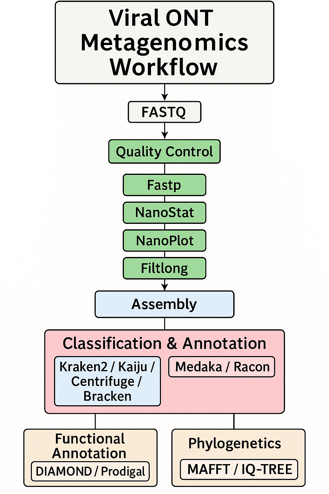

# Bunya-ONT-Gen: A pipeline for viral ONT metagenomic analysis

**Bunya-ONT-Gen** is a modular, end-to-end analysis pipeline designed for the characterization of viral genomes from Oxford Nanopore long-read metagenomic data. It is tailored for emerging and re-emerging viruses such as Bunyaviruses and supports everything from raw read quality control to phylogenetic tree construction.

---

## Key features

- Optimized for Oxford Nanopore (ONT) long-read data
- Human host read removal
- Quality control and filtering of metagenomic reads
- De novo assembly of viral genomes
- Taxonomic classification using multiple tools
- Functional gene annotation
- Phylogenetic tree for evolutionary inference


---

## Workflow overview



> The diagram illustrates nanopore metagenomic analysis pipeline, ending with phylogenetic tree construction using MAFFT and IQ-TREE.

### Steps:


#### 1. **Input**
- FASTQ files from ONT sequencers

#### 2. **Human reads removal**
- **Hostile**: Removes host sequences from short and long read (meta)genomes,
  
#### 3. **Quality control**
- **Fastp**: Adapter trimming and quality filtering
- **NanoStat**: Summary statistics of read quality
- **NanoPlot**: Visualization of read metrics
- **Filtlong**: Length-based read filtering

#### 4. **Assembly**
- Tools such as **Flye**, **Canu**, or **Raven** for long-read genome assembly

#### 5. **Classification & annotation**
- **Kraken2**, **Kaiju**, **Centrifuge**, or **Bracken** for taxonomic classification
- **Medaka** and **Racon** for polishing ONT assemblies

#### 6. **Functional annotation**
- **Prodigal** for gene prediction
- **DIAMOND** for fast similarity search against protein databases

#### 7. **Phylogenetic analysis**
- **MAFFT** for multiple sequence alignment
- **IQ-TREE** for phylogenetic tree inference with model selection

---

## Installation

# Hostile clean human reads pipeline

This pipeline removes human host reads (e.g., T2T-CHM13v2.0) from single-end Oxford Nanopore sequencing (ONT) data using `hostile` and `minimap2`. It supports automatic reference downloading via NCBI and is built for reproducibility and ease of use.

---


```bash
# Install all dependencies in a clean conda environment:
conda create -n hostile -c bioconda ncbi-datasets-cli minimap2 hostile
conda activate hostile


Required arguments

Argument	description
--fasta	  NCBI accession (e.g., GCF_009914755.4) or path to a local FASTA reference
-i, --input  Text file listing paths to FASTQ files (one per line)
-o, --output  Directory where cleaned results will be stored


```
Basic usage

```bash

# General usage
python3 hostile_clean_ont_human_minimap2.py \
  --fasta <ACCESSION_OR_PATH> \
  -i <INPUT_LIST> \
  -o <OUTPUT_DIR>

# Example using T2T-CHM13v2.0 human reference
python3 hostile_clean_ont_human_minimap2.py \
  --fasta GCF_009914755.4 \
  -i Bunya_ont_sample.list.txt \
  -o Clean

python3 hostile_clean_ont_human_minimap2.py --fasta GCF_009914755.4 -i Bunya_ont_sample.list.txt -o Clean

Input format

The input list file (Bunya_ont_sample.list.txt) should contain absolute or relative paths to single-end FASTQ files, one per line:


/path/to/sample1.fastq.gz
/path/to/sample2.fastq.gz


You can install all dependencies via conda using the provided `installer.yml`:


conda env create -f installer.yml
conda activate bunyagen

...

---

## Usage

Run the pipeline with the following structure:


```

---

## Output

- QC reports (`.html`, `.json`, `.pdf`)
- Assembled genome(s) (`.fasta`)
- Taxonomic classification table
- Predicted genes and protein functions
- Multiple sequence alignment and `.nwk` tree file

---

## Citing Bunya-ONT-Gen

If you use this pipeline, please cite this repository and the relevant tools individually.

---

## License

MIT License.

---


